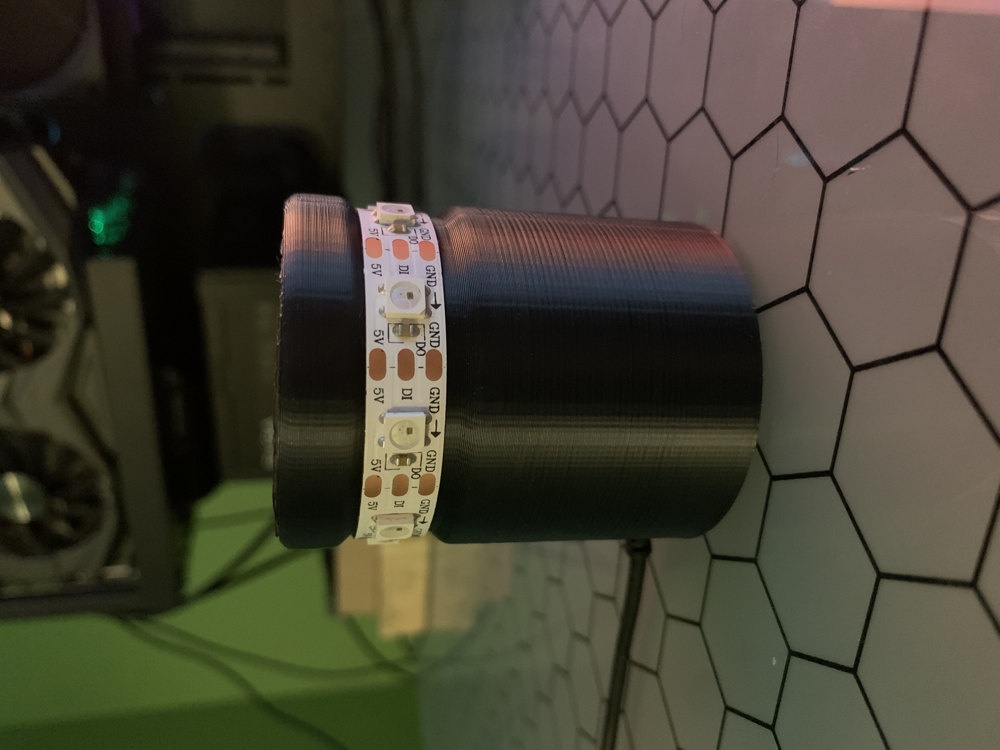

# Buildicator

Refrences/documentation:
 
NeoPixelBus object API:  https://github.com/Makuna/NeoPixelBus/wiki/NeoPixelBus-object-API
 
ESP8266ex datasheet: https://www.espressif.com/sites/default/files/documentation/0a-esp8266ex_datasheet_en.pdf

 
Demo: State (Previously successfull and currently building)

